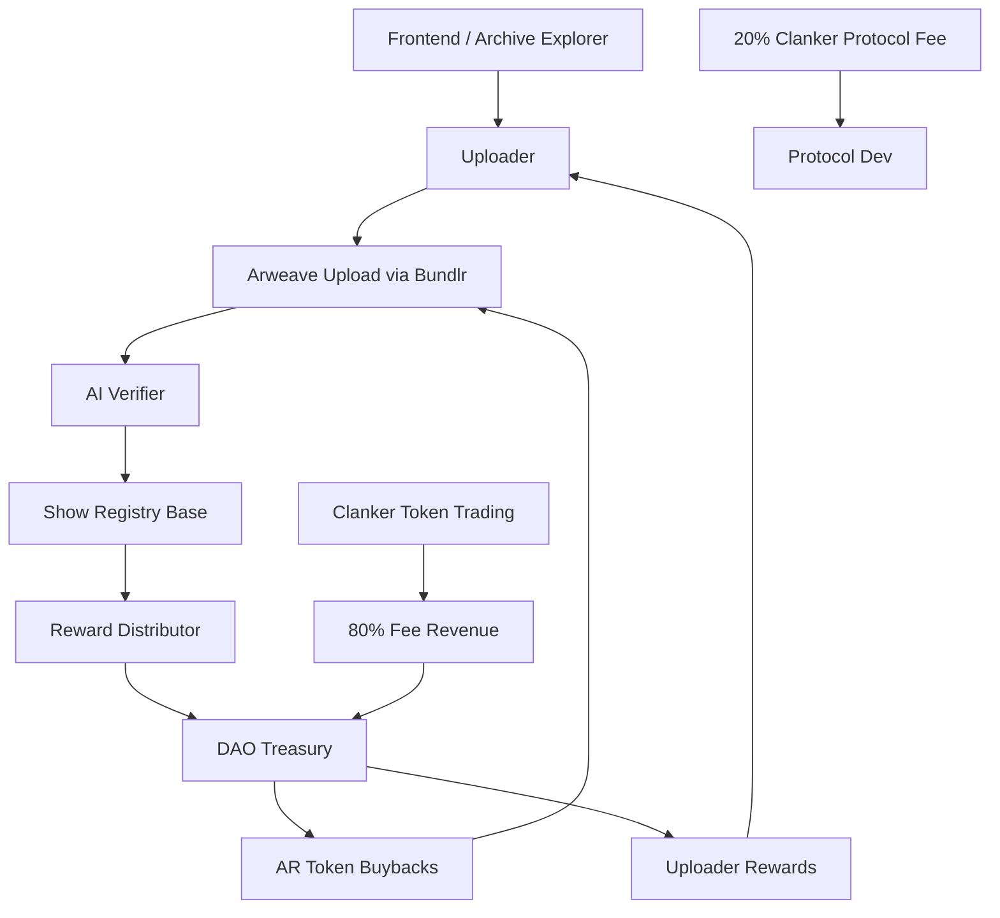

# **DeadW3: Decentralized Archive Preservation Protocol**
*A Whitepaper and Technical Specification*

---

## **Abstract**

The DeadW3 project creates a decentralized, censorship-resistant preservation system for cultural archives, starting with the **Grateful Dead live music recordings** currently hosted on Archive.org. By combining **Arweave's permanent storage**, **Clanker token deployment with automatic liquidity**, and **AI-assisted verification**, DeadW3 establishes a sustainable framework for archiving public digital heritage.

The technology, governance, and incentive systems described here form the foundation of a future **Archive.org Mirror Protocol** capable of safeguarding the wider Live Music Archive, Wayback Machine, and other key cultural repositories. The integration of Clanker's automated market-making infrastructure ensures continuous treasury funding through trading fee revenue, creating a self-sustaining economic model.

---

## **1. Mission and Vision**

### **Mission Statement**
> To ensure that the world's cultural and digital memory — from music to the web itself — outlives the platforms that host it, sustained by community-driven economic activity.

### **Vision**
A decentralized ecosystem where archivists, curators, and AI agents collaborate to mirror and preserve humanity's shared history in permanent, verifiable form, funded by a self-sustaining tokenomic model that converts trading activity into permanent storage capacity.

### **Initial Focus**
- **Pilot Collection:** Grateful Dead live recordings from Archive.org's "Grateful Dead" collection.  
- **Economic Innovation:** Leverage Clanker's automated liquidity and fee distribution to fund perpetual Arweave storage.
- **Long-Term Goal:** Expand into a full **Archive.org Mirror Network** preserving multiple cultural domains (music, books, websites, etc.).

---

## **2. Core Principles**
- **Permanence:** Store data forever on Arweave.
- **Integrity:** Verify authenticity through cryptographic and AI-based analysis.
- **Transparency:** Record metadata, provenance, and verification results on-chain.
- **Self-Sustainability:** Trading fee revenue continuously funds storage and operations.
- **Community Ownership:** Governed by a DAO funded by protocol economics.
- **Open Access:** All archives remain freely accessible for non-commercial use.

---

## **3. System Architecture**

### **3.1 Overview**
The DeadW3 protocol consists of six interacting layers:

1. **Storage Layer:** Arweave + Bundlr (permanent decentralized storage)
2. **Verification Layer:** AI + LLM pipeline ensures data integrity and policy compliance
3. **Token Layer:** Clanker-deployed $DEADW3 with automatic Uniswap v4 liquidity
4. **Blockchain Layer:** Ethereum-compatible contracts on Base network manage submissions, staking, and rewards
5. **Index Layer:** Arweave GraphQL + Postgres indexer for metadata search and retrieval
6. **Application Layer:** Web app, API, and DAO interfaces for users and curators



---

## **4. Technical Components**

### **4.1 Storage Layer (Arweave)**

| Component | Purpose |
|------------|----------|
| **Arweave** | Permanent decentralized data storage |
| **Bundlr** | Scalable Arweave upload gateway |
| **ANS-104 Manifest** | Defines relationships between audio, documents, and metadata |
| **Arweave Tags** | Store key metadata (date, venue, lineage, checksum, license) |

**Example Tags:**
```
App-Name: deadw3-archive
Band: Grateful Dead
Show-Date: 1977-05-08
Venue: Barton Hall
City: Ithaca
Country: USA
Source: AUD
Rights: NonCommercial-ShareAlike
Checksum: 0x1234abcd...
```

---

### **4.2 Verification Layer (AI Agent)**

**Purpose:** Automate the validation of uploaded archives to ensure integrity, compliance, and originality.

**Components:**
- `blake3` tree hashing for file integrity
- `chromaprint` audio fingerprinting for duplicate detection
- `librosa` and `soundfile` for audio quality analysis
- LLM text reasoning for lineage normalization and rights compliance
- Structured JSON report pinned to Arweave

**Verification Workflow:**
1. Fetch ANS-104 manifest and tags
2. Validate checksums (`ffp.txt` vs computed)
3. Extract and normalize metadata
4. Perform audio and policy checks
5. Generate structured verification report
6. Submit `ShowVerified` event on Base chain

**Sample JSON Report:**
```json
{
  "version": "1.0",
  "arweaveTxId": "abc123",
  "metadata": {"date": "1977-05-08", "venue": "Barton Hall"},
  "integrity": {"ffp": "PASS", "hashMismatches": []},
  "audioQuality": {"sampleRate": 48000, "clipping": false},
  "duplication": {"dupScore": 0.83},
  "policy": {"risk": 0},
  "scores": {"overall": 95},
  "verdict": "AUTO_ACCEPT"
}
```

---

### **4.3 Token Layer (Clanker Integration)**

**Why Clanker:**
DeadW3 leverages Clanker for token deployment to achieve:
- **Automatic Liquidity:** Immediate price discovery and trading capability
- **Permanent Liquidity Lock:** LP positions locked forever, ensuring market stability
- **Fee Revenue Stream:** 80% of trading fees flow to DAO treasury
- **No Manual Liquidity Management:** No need for DEX listings or liquidity provision
- **Proven Infrastructure:** Battle-tested Uniswap v4 hooks and fee distribution

**Token Specifications:**
| Parameter | Value |
|------------|--------|
| Token Symbol | $DEADW3 |
| Network | Base (with Superchain compatibility) |
| Standard | ERC-20 (via Clanker) |
| Total Supply | 100,000,000,000 (100 billion, fixed) |
| Mintability | Non-mintable (fixed supply) |
| Burnability | Yes (ERC20Burnable) |
| Liquidity Pairing | WETH |
| Starting Market Cap | 10 WETH (configurable) |
| LP Lock | Permanent (via Clanker LP Locker) |

**Clanker Configuration:**
```typescript
{
  name: "DeadW3 Archive Token",
  symbol: "DEADW3",
  pairedToken: "WETH",
  initialMarketCap: 10, // 10 ETH starting mcap
  vault: {
    percentage: 25, // 25% to DAO vault
    lockupDuration: 7776000, // 90 days in seconds
    vestingDuration: 15552000, // 180 days vesting
    recipient: DAO_TREASURY_ADDRESS
  },
  rewardRecipients: [
    {
      admin: DAO_MULTISIG,
      recipient: DAO_TREASURY_ADDRESS,
      bps: 10000, // 100% of creator fees to DAO
      token: "Paired" // Receive fees in WETH
    }
  ]
}
```

---

### **4.4 Blockchain Layer (Base Network)**

| Contract | Purpose |
|-----------|----------|
| **DEADW3 Token** | Clanker-deployed ERC-20 with automatic liquidity |
| **ShowRegistry** | Records uploads, hashes, verification reports |
| **RewardDistributor** | Manages staking and uploader rewards from treasury |
| **GovernanceDAO** | Controls parameters, treasury, and curation rules |
| **TreasuryManager** | Converts WETH fees to AR tokens and uploader rewards |

**Key Struct:**
```solidity
struct Show {
    address uploader;
    string arweaveTxId;
    bytes32 rootHash;
    uint32 dateYMD;
    uint8 status;
    uint8 aiScore;
    uint256 rewardAmount;
}
```

**New Treasury Flow Contract:**
```solidity
contract TreasuryManager {
    // Receives WETH from Clanker fee locker
    // Executes two strategies:
    // 1. Buy AR tokens for storage endowment
    // 2. Distribute rewards to verified uploaders
    
    function setAllocationRatio(
        uint256 arBuybackBps,
        uint256 uploaderRewardBps
    ) external onlyGovernance;
    
    function executeArBuyback() external;
    function distributeUploaderRewards() external;
}
```

---

### **4.5 Index Layer**
- **Postgres** stores verified metadata for fast search.
- **Arweave GraphQL (ArDB)** provides public query access.
- **Duplicate detection**: use `BLAKE3` + `Chromaprint` fingerprints.
- **API Endpoints:** `/shows`, `/artists`, `/venues`, `/verify`, `/treasury`.

---

### **4.6 Application Layer**
- **Frontend:** Next.js + shadcn UI with dark/light themes.
- **Features:** Upload wizard, curator dashboard, AI report viewer, streaming player, treasury dashboard.
- **Auth:** Farcaster or Ethereum wallet (via RainbowKit).
- **Extra:** Farcaster Frame integration for sharing shows and token discovery.
- **Treasury Transparency:** Real-time display of fee revenue, AR purchases, and reward distributions.

---

## **5. Tokenomics & Economic Model**

### **5.1 Token Distribution**

Since Clanker tokens have a fixed supply of 100 billion tokens and are non-mintable, the distribution occurs at deployment:

| Allocation | Amount (Tokens) | Percentage | Mechanism |
|------------|-----------------|------------|-----------|
| Uniswap v4 Liquidity | 75,000,000,000 | 75% | Locked permanently in LP |
| DAO Treasury Vault | 25,000,000,000 | 25% | 90-day lockup, 180-day vesting |
| **Total Supply** | **100,000,000,000** | **100%** | **Fixed, non-mintable** |

**Important Notes:**
- The 75B tokens in the LP are **permanently locked** and can never be withdrawn
- The 25B DAO tokens will vest gradually and can be used for:
  - Governance incentives
  - Strategic partnerships
  - Ecosystem grants
  - Emergency liquidity (if needed)
  - Long-term treasury reserves

---

### **5.2 Revenue Model: Trading Fees**

**Primary Revenue Source:** Uniswap v4 trading fees from the DEADW3/WETH pool.

**Fee Distribution:**
- **80%** → DAO Treasury (received in WETH)
- **20%** → Clanker Protocol (platform fee)

**Fee Utilization by DAO:**
The DAO treasury uses WETH fee revenue for two primary purposes, with allocation ratios governed by the community:

| Use Case | Initial Allocation | Purpose |
|----------|-------------------|---------|
| **AR Token Buybacks** | 60% | Purchase AR tokens for ongoing storage costs |
| **Uploader Rewards** | 40% | Incentivize verified content uploads |

**Dynamic Allocation:**
The DAO can adjust the 60/40 split based on:
- Storage requirements (more archives = more AR needed)
- Upload activity levels
- AR token price changes
- Treasury reserve targets

---

### **5.3 Uploader Reward System**

**Eligibility:**
Only uploads that pass AI verification and curator review earn rewards.

**Reward Calculation:**
```
Reward = BaseReward × QualityMultiplier × RarityMultiplier
```

**Factors:**
- **BaseReward:** Set by DAO governance, paid in WETH
- **QualityMultiplier:** Based on AI verification score (0.5x - 2.0x)
- **RarityMultiplier:** Higher rewards for rare/high-demand content
- **Early Archivist Bonus:** Decaying bonus for early contributors

**Example Reward Schedule (Initial):**
| Verification Score | Quality Multiplier | Base Reward (WETH) |
|-------------------|-------------------|-------------------|
| 95-100 | 2.0x | 0.01 ETH × 2.0 = 0.02 ETH |
| 85-94 | 1.5x | 0.01 ETH × 1.5 = 0.015 ETH |
| 75-84 | 1.0x | 0.01 ETH × 1.0 = 0.01 ETH |
| 65-74 | 0.75x | 0.01 ETH × 0.75 = 0.0075 ETH |
| < 65 | No Reward | Requires manual review |

**Sustainability:**
As trading volume increases, the treasury accumulates more WETH, allowing for:
- Larger per-upload rewards
- More aggressive AR token acquisition
- Long-term financial stability

---

### **5.4 Treasury Management Strategy**

**AR Token Acquisition:**
The treasury maintains a strategic reserve of AR tokens to ensure:
- Sufficient funds for ongoing uploads (target: 2-year runway)
- Buffer for AR price volatility
- Ability to capitalize on favorable pricing

**Buyback Execution:**
- Automated monthly buybacks via smart contract
- Uses decentralized AR/ETH liquidity pools
- Transparent on-chain execution
- Governed by community-approved parameters

**Treasury Dashboard Metrics:**
- Total WETH accumulated from trading fees
- AR tokens held and purchasing power
- Uploader rewards distributed (total and per show)
- Projected storage runway at current upload rates
- Fee revenue trend analysis

---

### **5.5 Token Utility**

The $DEADW3 token serves multiple functions in the ecosystem:

1. **Governance Voting:**
   - 1 token = 1 vote
   - Delegated voting supported
   - Proposal creation threshold: 1M tokens

2. **Curator Staking:**
   - Stake tokens to become a curator
   - Earn reputation multipliers
   - Risk slashing for bad approvals

3. **Priority Verification:**
   - Token holders can fast-track AI verification
   - Optional feature, not required for basic use

4. **Trading Activity = Protocol Funding:**
   - Every trade contributes to treasury
   - Organic market activity funds public goods
   - No inflation or continuous token sales needed

5. **Future Utility Expansion:**
   - Cross-archive verification payments
   - Premium API access
   - Archive bounties and grants

---

### **5.6 Economic Sustainability Analysis**

**Revenue Projections:**

Assuming:
- Average daily trading volume: $100,000
- Uniswap v4 pool fee: 1% (typical for newer tokens)
- 80% fee share to DAO: $800/day
- Monthly treasury revenue: ~$24,000

**Cost Structure:**

| Expense Category | Monthly Cost (Est.) | Notes |
|-----------------|---------------------|-------|
| Arweave Storage | $5,000 - $15,000 | Varies with upload volume |
| Uploader Rewards | $5,000 - $10,000 | Varies with verification rate |
| Infrastructure | $2,000 | API, indexer, verification worker |
| Operations | $2,000 | Governance, community management |
| **Total** | **$14,000 - $29,000** | |

**Break-Even Analysis:**
- At $24K monthly revenue, protocol is sustainable
- Higher trading volume = larger treasury surplus
- Surplus used for AR reserves and expanded operations

**Growth Scenarios:**

| Scenario | Daily Volume | Monthly Revenue | Sustainability |
|----------|-------------|-----------------|----------------|
| Conservative | $50K | $12K | Marginal |
| Target | $100K | $24K | Sustainable |
| Growth | $500K | $120K | Highly Profitable |
| Viral | $1M+ | $240K+ | Fund Expansion |

---

## **6. DAO Governance Configuration**

### **6.1 DAO Structure: Multi-tier Hybrid DAO**

| Layer | Description |
|--------|-------------|
| **Curator DAO** | Domain experts + verifiers approve final decisions |
| **Treasury DAO** | Controls DEADW3 treasury, AR purchases, reward allocations |
| **Policy DAO** | Defines content compliance and license rules |
| **Root DAO** | Aggregates the above, governing cross-domain parameters |

**Implementation:**
- Initially 5/7 multisig (Safe) → transitions to on-chain governance (Governor contract).
- Treasury actions require time-locks for transparency.

---

### **6.2 Voting Power & Delegation**

**Base Voting Rights:**
- 1 $DEADW3 token = 1 vote
- Delegation supported (ERC20Votes)
- Vote weight snapshot at proposal creation

**Reputation Multipliers:**
Staked tokens yield higher voting power based on contribution history:
- **Verified Uploader:** 1.5x multiplier
- **Active Curator:** 2.0x multiplier
- **Long-term Staker (6+ months):** 1.25x multiplier
- **Multipliers stack:** Maximum 3.0x effective voting power

**Proposal Threshold:**
- Create proposal: 1,000,000 tokens (1% of supply in circulation)
- Quorum requirement: 4% of circulating supply
- Voting period: 7 days
- Execution delay: 2 days (timelock)

---

### **6.3 Governance Proposal Types**

1. **Curator Management**
   - Add/Remove curator addresses
   - Adjust curator staking requirements
   - Modify slashing parameters

2. **Economic Parameters**
   - Adjust AR buyback / uploader reward split
   - Modify base reward amounts
   - Update quality multipliers

3. **Treasury Actions**
   - Approve large expenditures (>$10K)
   - Strategic AR token purchases
   - Grant distributions

4. **Content Policy**
   - Approve new Archive.org collections
   - Define licensing requirements
   - Emergency delisting procedures

5. **Protocol Upgrades**
   - Smart contract improvements
   - New verification models
   - Integration expansions

---

### **6.4 Treasury Governance Controls**

**Automated Actions (No Vote Required):**
- Regular AR token buybacks within approved parameters
- Uploader reward distributions per approved schedule
- Infrastructure payments below threshold

**Governance-Required Actions:**
- Changes to AR buyback percentage
- Base reward amount adjustments
- Expenditures exceeding $10,000
- New treasury wallet deployments
- Emergency treasury pause

**Transparency Requirements:**
- All treasury transactions on-chain
- Monthly financial reports
- Real-time dashboard of treasury state
- Annual third-party audits

---

## **7. Expansion to Archive.org Mirror Protocol**

**Phase I — Grateful Dead Pilot** (Months 0-6)
- Deploy $DEADW3 via Clanker
- Mirror and verify 100 shows
- Establish trading volume and fee revenue
- Launch community governance
- Build 6-month AR storage reserve

**Phase II — Live Music Archive** (Months 6-12)
- Extend verification models for all bands
- Launch artist-specific curator DAOs
- Scale to 1,000+ shows
- Achieve treasury sustainability milestone

**Phase III — Public Archives** (Year 2)
- Books, zines, and open-license texts
- Integration with Internet Archive metadata APIs
- Multi-format verification pipelines

**Phase IV — Wayback Mirror** (Year 2-3)
- Web snapshot preservation and deduplication
- AI content parsing and compliance checks
- Massive-scale storage infrastructure

**Phase V — Cross-Protocol Archive Alliance** (Year 3+)
- Federation with other cultural archives
- Shared verification standards
- Cross-chain governance bridges
- Interoperable preservation network

---

## **8. Sustainability and Ethics**

### **8.1 Content Policy**
- Respect all license terms and artist wishes
- Maintain provenance and source attribution
- Non-commercial use preservation only
- Community-driven content moderation

### **8.2 Technical Openness**
- Open-source verification code
- Transparent AI model training data
- Public smart contract audits
- Reproducible verification reports

### **8.3 Operational Structure**
- DAO operates as public goods protocol
- No private profit extraction from core protocol
- Transparent fee allocation
- Community treasury oversight

### **8.4 Ecosystem Collaboration**
- Maintain positive relationship with Archive.org
- Encourage complementary preservation efforts
- Support other decentralized archive initiatives
- Foster interoperability standards

### **8.5 Long-term Viability**
- Fee-based funding eliminates reliance on grants
- AR token reserves provide multi-year runway
- Trading activity aligns with cultural value
- Governance ensures adaptive management

---

## **9. Risks & Mitigations**

| Risk | Impact | Mitigation Strategy |
|------|--------|---------------------|
| **Insufficient Trading Volume** | Medium | Multi-chain deployment, marketing, partnerships |
| **AR Token Price Volatility** | Medium | Maintain 2-year storage reserve, dollar-cost averaging |
| **Legal Challenges** | High | Restrict to public domain/licensed works, legal counsel |
| **Sybil Attacks on Uploads** | Medium | Stake requirements, AI verification, curator review |
| **AI Misclassification** | Low | Human curator override, appeal process |
| **Smart Contract Exploits** | High | Professional audits, bug bounties, insurance |
| **Clanker Platform Risk** | Low | Contracts immutable and decentralized, no admin keys |
| **Low-Quality Uploads** | Medium | Quality-based rewards, community moderation |
| **Treasury Mismanagement** | Medium | Multi-sig controls, governance transparency, audits |
| **Duplicate Spam** | Low | Fingerprinting, deduplication algorithms, stake loss |

**Emergency Response Protocols:**
- Pause mechanisms on critical contracts
- DAO-controlled emergency multisig
- Bug bounty program
- Insurance coverage for treasury
- Incident response runbook

---

## **10. Technical Advantages of Clanker Integration**

### **10.1 Why Clanker vs. Traditional ERC-20**

| Aspect | Traditional Deployment | Clanker Deployment |
|--------|----------------------|-------------------|
| Liquidity | Manual DEX listing, requires capital | Automatic, 75% supply locked |
| LP Management | Can be rug-pulled | Permanently locked |
| Price Discovery | Delayed, manual | Immediate |
| Fee Collection | Manual setup | Automated via hooks |
| Smart Contract Complexity | Custom treasury logic | Proven infrastructure |
| Time to Market | Weeks | Minutes |
| Trust Requirements | High (LP provider trust) | Low (immutable locks) |

### **10.2 Uniswap v4 Hook Benefits**

**Automated Fee Distribution:**
- Clanker hooks automatically route 80% of fees to DAO
- No manual claim processes
- Real-time fee accrual
- Transparent on-chain accounting

**MEV Protection:**
- Built-in sniper auction mechanisms
- Delayed swaps prevent front-running
- Fair launch mechanics

**Composability:**
- Can integrate additional hooks
- Future protocol upgrades
- Cross-protocol integrations

### **10.3 Superchain Compatibility**

**Multi-Chain Strategy:**
Deploy $DEADW3 on multiple Superchain networks:
- Base (primary, most liquidity)
- Optimism (Ethereum L2, larger audience)
- Arbitrum (optional expansion)

**Benefits:**
- Same token address across chains
- Bridgeable liquidity
- Redundancy and decentralization
- Reach different user bases

**Implementation:**
Use Clanker's Superchain ERC20 compatibility to deploy with same address on each chain, enabling seamless bridging.

---

## **11. Comparison: Old vs. New Economic Model**

### **11.1 Previous Model (Pre-Clanker)**

**Token Deployment:**
- Manual ERC-20 deployment
- Mintable supply, 100M max
- Manual DEX liquidity provision required

**Distribution:**
- 50% Upload Rewards (minted over time)
- 20% Verifier Rewards (minted over time)
- 15% DAO Treasury (pre-minted)
- 10% Ecosystem Growth (pre-minted)
- 5% Founders (pre-minted)

**Challenges:**
- Requires significant upfront capital for liquidity
- Token emissions create sell pressure
- Complex treasury management
- Manual reward distributions
- Risk of liquidity removal

### **11.2 New Model (With Clanker)**

**Token Deployment:**
- Clanker automated deployment
- Fixed 100B supply, non-mintable
- Automatic liquidity on Uniswap v4

**Distribution:**
- 75% Permanent LP (locked forever)
- 25% DAO Treasury (vested)
- No token emissions needed
- Fee revenue funds operations

**Advantages:**
- Zero upfront liquidity capital needed
- No inflation or sell pressure from emissions
- Automatic, continuous treasury funding
- Self-sustaining economic model
- Permanent liquidity guarantee
- Immediate price discovery

**Revenue Comparison:**

*Old Model:*
- Relies on token value appreciation
- Treasury must sell tokens to fund operations
- Creates sell pressure, reducing token value

*New Model:*
- Relies on trading fee revenue
- Treasury receives WETH directly
- No sell pressure on DEADW3 token
- Trading activity becomes public goods funding

---

## **12. Implementation Roadmap**

### **12.1 Pre-Launch (Weeks 1-2)**

- [x] Update whitepaper with Clanker integration
- [ ] Prepare Clanker deployment parameters
- [ ] Set up DAO multisig on Base
- [ ] Audit treasury management contracts
- [ ] Configure initial governance parameters
- [ ] Prepare community launch materials

### **12.2 Token Launch (Week 3)**

**Day 1: Token Deployment**
- Deploy $DEADW3 via Clanker on Base
- Confirm LP lock and fee routing
- Verify DAO vault lockup
- Announce on Farcaster and social channels

**Day 2-7: Initial Trading Period**
- Monitor trading volume and liquidity
- Track fee accumulation
- Engage community on Farcaster
- Begin curator onboarding

### **12.3 Protocol Launch (Weeks 4-6)**

- Deploy ShowRegistry contract
- Deploy RewardDistributor contract
- Deploy TreasuryManager contract
- Configure AI verification worker
- Launch frontend MVP
- Enable first uploads

### **12.4 Growth Phase (Months 2-3)**

- Onboard first 10 verified shows
- Distribute first uploader rewards
- Execute first AR token buyback
- Iterate on verification models
- Scale infrastructure

### **12.5 Sustainability Milestone (Month 6)**

**Success Criteria:**
- 100+ verified shows archived
- $50K+ in treasury reserves
- 2-year AR storage runway achieved
- Active governance participation
- Consistent trading volume

---

## **13. Community & Ecosystem**

### **13.1 Farcaster Integration**

**Primary Social Platform:**
DeadW3 will be deeply integrated with Farcaster:
- Token launched via Clanker (Farcaster-native)
- Frame integration for show discovery
- Social reputation for curators
- Community governance discussions
- Direct upload submissions via Frames

**Farcaster Frames:**
- Embed show players in casts
- One-click archive browsing
- Curator voting interfaces
- Treasury dashboard sharing

### **13.2 Community Roles**

**Archivists:**
- Upload verified shows
- Earn WETH rewards
- Build reputation
- Receive early bonuses

**Curators:**
- Review AI verdicts
- Stake DEADW3 tokens
- Earn curation rewards
- Vote on policy

**Traders:**
- Provide liquidity through trading
- Indirectly fund public goods
- Participate in price discovery

**Governors:**
- Hold DEADW3 tokens
- Vote on proposals
- Shape protocol direction
- Delegate voting power

### **13.3 Partnerships & Integrations**

**Target Collaborations:**
- Archive.org (data partnership)
- GD50.com (Grateful Dead community)
- Etree.org (taper community)
- Farcaster ecosystem projects
- Arweave developer community
- Base ecosystem projects

**Integration Opportunities:**
- Wallet apps (Rainbow, Coinbase Wallet)
- Music discovery platforms
- Decentralized music streaming
- NFT marketplaces (for show covers)
- Other cultural archive projects

---

## **14. Conclusion**

DeadW3 represents a new model for digital preservation that aligns economic incentives with public goods creation. By leveraging Clanker's automated token infrastructure, the protocol achieves:

1. **Self-Sustaining Economics:** Trading fees continuously fund operations without inflation or token sales.

2. **Permanent Liquidity:** 75% of supply locked forever ensures market stability and trust.

3. **Transparent Governance:** All treasury actions on-chain with community oversight.

4. **Scalable Infrastructure:** Proven Uniswap v4 hooks and Superchain compatibility enable multi-chain expansion.

5. **Cultural Mission:** Preserving humanity's shared heritage while creating a template for future public goods protocols.

The integration of Clanker transforms DeadW3 from a traditional DAO treasury model into a continuously funded, self-sustaining protocol. Every trade contributes to permanent cultural preservation. Every fee collected extends the archive's lifespan. Every participant becomes a patron of digital memory.

**We're not just archiving the Grateful Dead — we're building the economic foundation for eternal cultural preservation.**

> *"The music never stopped — and now, neither will the memory or the funding."*

---

## **Appendix A: Clanker Deployment Transaction**

**Example Deployment Call:**

```typescript
import { clankerSDK } from '@clanker/sdk';

const deployment = await clankerSDK.deployToken({
  // Basic Info
  name: "DeadW3 Archive Token",
  symbol: "DEADW3",
  imageUrl: "https://arweave.net/deadw3-logo.png",
  
  // Network
  chainId: 8453, // Base
  
  // Liquidity Config
  pairedToken: "WETH",
  initialMarketCap: 10, // 10 ETH starting mcap
  
  // Pool Config
  poolType: "Recommended", // Optimized multi-position LP
  feeConfig: "Dynamic", // Variable fees based on volatility
  
  // Treasury Vault (25% of supply)
  vault: {
    percentage: 25,
    lockupDuration: 7776000, // 90 days
    vestingDuration: 15552000, // 180 days
    recipient: "0xDAOTreasuryAddress..."
  },
  
  // Fee Recipients (80% to DAO)
  rewardRecipients: [
    {
      admin: "0xDAOMultisigAddress...",
      recipient: "0xDAOTreasuryAddress...",
      bps: 10000, // 100% of creator share
      token: "Paired" // Receive in WETH
    }
  ],
  
  // Metadata
  description: "DeadW3 preserves cultural archives on Arweave, starting with Grateful Dead recordings. Trading fees fund permanent storage.",
  website: "https://deadw3.org",
  twitter: "https://twitter.com/deadw3",
  farcaster: "https://warpcast.com/deadw3",
  telegram: "https://t.me/deadw3"
});

console.log(`Token deployed: ${deployment.address}`);
console.log(`Clanker page: https://clanker.world/clanker/${deployment.address}`);
```

---

## **Appendix B: Treasury Smart Contract**

**TreasuryManager.sol (Simplified):**

```solidity
// SPDX-License-Identifier: MIT
pragma solidity ^0.8.20;

import "@openzeppelin/contracts/access/AccessControl.sol";
import "@openzeppelin/contracts/security/ReentrancyGuard.sol";

interface IERC20 {
    function transfer(address to, uint256 amount) external returns (bool);
    function balanceOf(address account) external view returns (uint256);
}

interface IArweaveSwap {
    function buyAR(uint256 wethAmount) external returns (uint256 arAmount);
}

contract TreasuryManager is AccessControl, ReentrancyGuard {
    bytes32 public constant GOVERNANCE_ROLE = keccak256("GOVERNANCE_ROLE");
    
    IERC20 public immutable weth;
    IERC20 public immutable arToken;
    IArweaveSwap public arweaveSwap;
    
    // Allocation in basis points (10000 = 100%)
    uint256 public arBuybackBps = 6000; // 60%
    uint256 public uploaderRewardBps = 4000; // 40%
    
    address public uploaderRewardPool;
    
    event AllocationUpdated(uint256 arBuybackBps, uint256 uploaderRewardBps);
    event ArBuyback(uint256 wethSpent, uint256 arReceived);
    event UploaderRewardsFunded(uint256 wethAmount);
    
    constructor(
        address _weth,
        address _arToken,
        address _arweaveSwap,
        address _uploaderRewardPool
    ) {
        weth = IERC20(_weth);
        arToken = IERC20(_arToken);
        arweaveSwap = IArweaveSwap(_arweaveSwap);
        uploaderRewardPool = _uploaderRewardPool;
        
        _grantRole(DEFAULT_ADMIN_ROLE, msg.sender);
        _grantRole(GOVERNANCE_ROLE, msg.sender);
    }
    
    function setAllocationRatio(
        uint256 _arBuybackBps,
        uint256 _uploaderRewardBps
    ) external onlyRole(GOVERNANCE_ROLE) {
        require(_arBuybackBps + _uploaderRewardBps == 10000, "Must sum to 10000");
        arBuybackBps = _arBuybackBps;
        uploaderRewardBps = _uploaderRewardBps;
        emit AllocationUpdated(_arBuybackBps, _uploaderRewardBps);
    }
    
    function executeTreasuryOperations() external nonReentrant {
        uint256 wethBalance = weth.balanceOf(address(this));
        require(wethBalance > 0, "No WETH to process");
        
        // Calculate allocations
        uint256 arBuybackAmount = (wethBalance * arBuybackBps) / 10000;
        uint256 uploaderRewardAmount = wethBalance - arBuybackAmount;
        
        // Execute AR buyback
        if (arBuybackAmount > 0) {
            weth.transfer(address(arweaveSwap), arBuybackAmount);
            uint256 arReceived = arweaveSwap.buyAR(arBuybackAmount);
            emit ArBuyback(arBuybackAmount, arReceived);
        }
        
        // Fund uploader rewards
        if (uploaderRewardAmount > 0) {
            weth.transfer(uploaderRewardPool, uploaderRewardAmount);
            emit UploaderRewardsFunded(uploaderRewardAmount);
        }
    }
    
    function getArReserve() external view returns (uint256) {
        return arToken.balanceOf(address(this));
    }
}
```

---

## **Appendix C: Fee Revenue Projections**

**Conservative Scenario (Daily Volume: $50,000)**
- Daily LP Fees (1%): $500
- DAO Share (80%): $400
- Monthly Revenue: $12,000
- Annual Revenue: $144,000

**Target Scenario (Daily Volume: $100,000)**
- Daily LP Fees (1%): $1,000
- DAO Share (80%): $800
- Monthly Revenue: $24,000
- Annual Revenue: $288,000

**Growth Scenario (Daily Volume: $500,000)**
- Daily LP Fees (1%): $5,000
- DAO Share (80%): $4,000
- Monthly Revenue: $120,000
- Annual Revenue: $1,440,000

**Break-even Analysis:**
- Monthly operating costs: ~$20,000
- Required daily volume: ~$85,000
- Required market cap for this volume: ~$500K - $2M (varies by market conditions)

---

## **Appendix D: Governance Parameter Suggestions**

**Initial Values (Subject to DAO Ratification):**

| Parameter | Initial Value | Adjustment Mechanism |
|-----------|--------------|---------------------|
| AR Buyback Allocation | 60% | Governance vote |
| Uploader Reward Allocation | 40% | Governance vote |
| Base Reward (WETH) | 0.01 ETH | Governance vote |
| Quality Multiplier Range | 0.5x - 2.0x | Curator DAO |
| Curator Stake Requirement | 100,000 DEADW3 | Governance vote |
| Proposal Threshold | 1,000,000 DEADW3 | Root DAO vote |
| Voting Period | 7 days | Root DAO vote |
| Timelock Delay | 2 days | Root DAO vote |
| Minimum Quorum | 4% | Root DAO vote |

**Adjustment Triggers:**
- Quarterly treasury reviews
- Significant AR price changes (±30%)
- Upload volume changes (±50%)
- Community proposals reaching quorum
